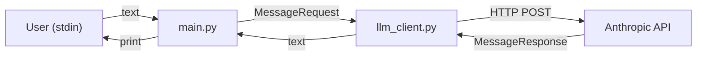
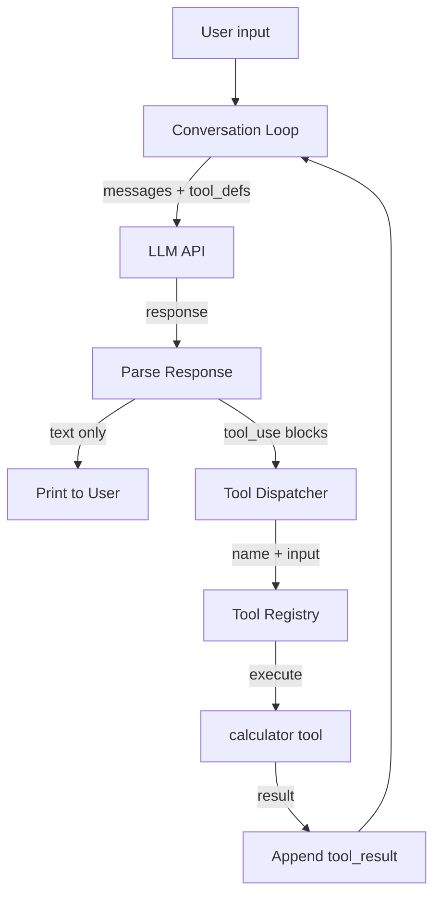
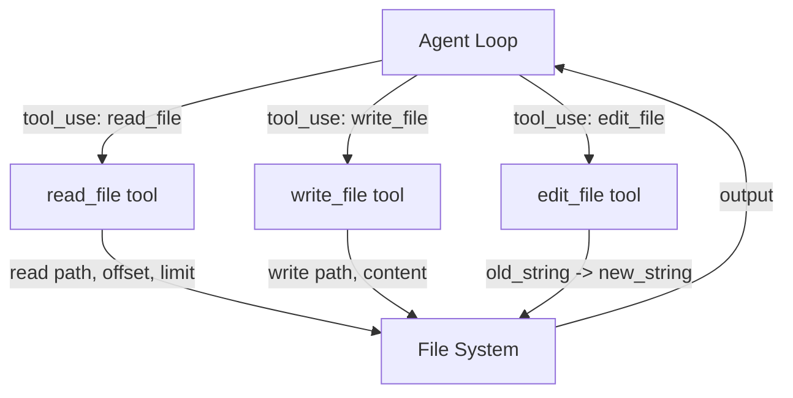
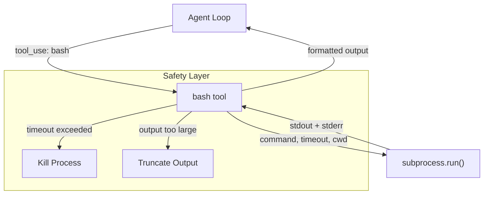
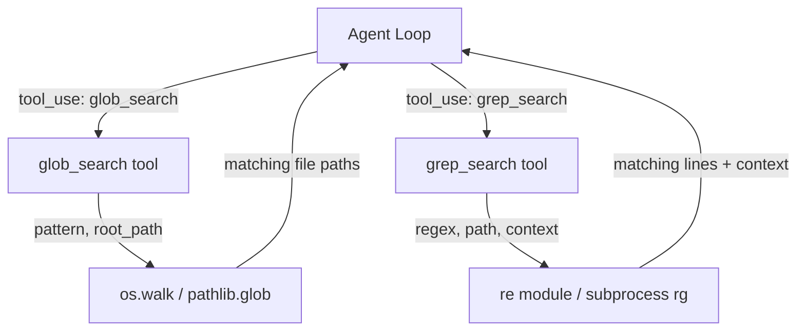
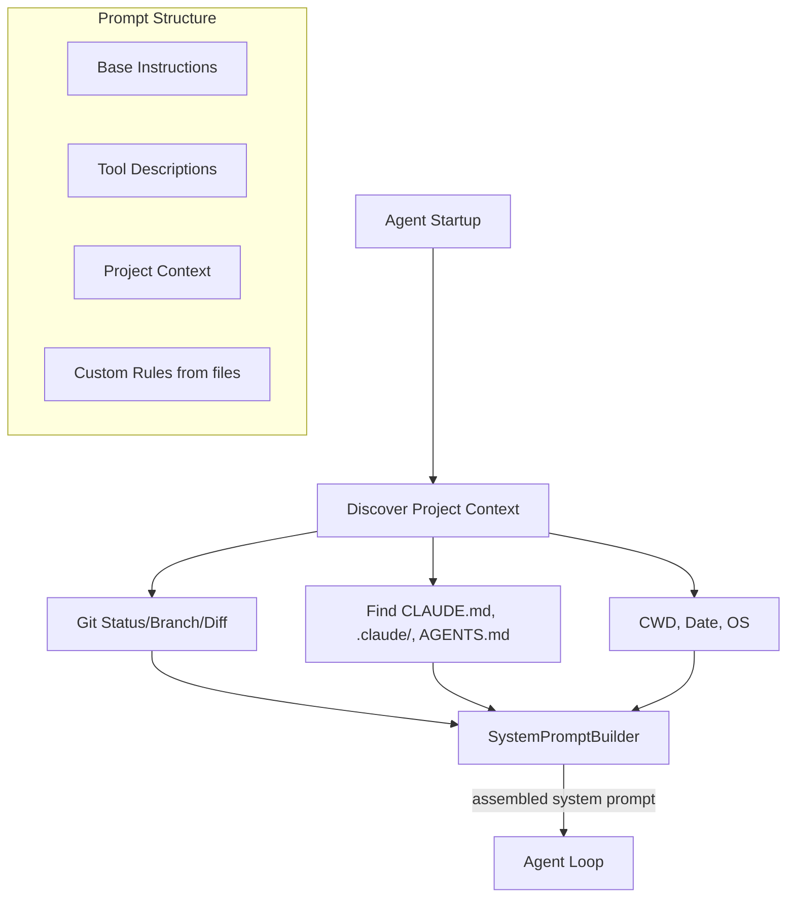
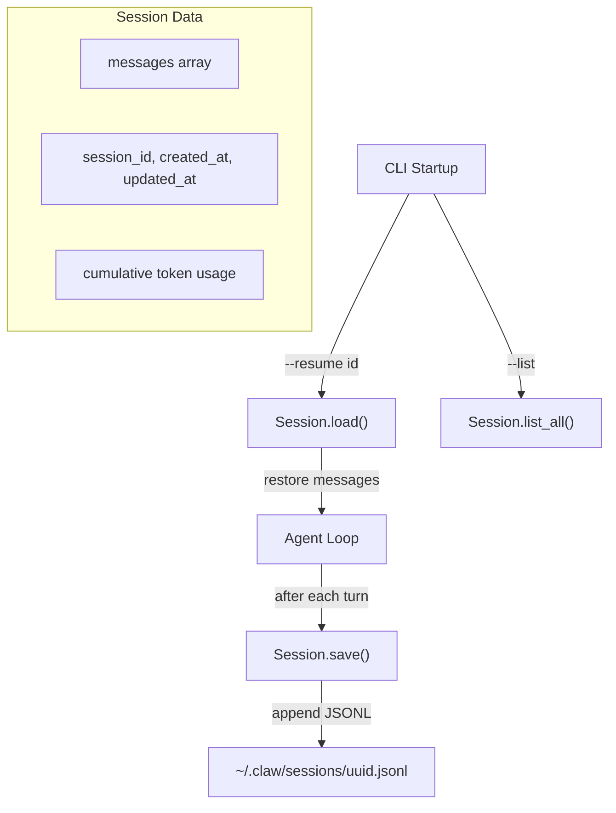
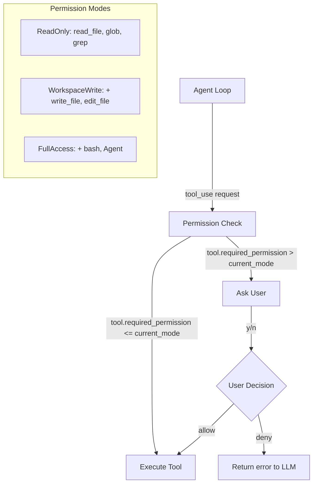
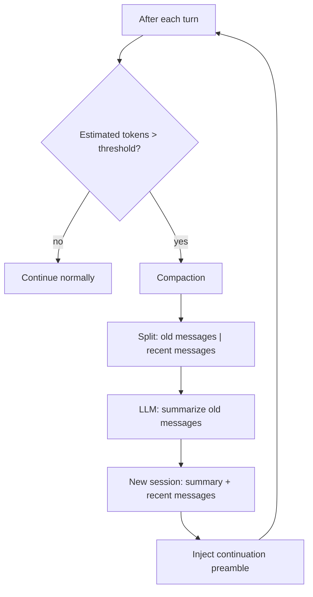
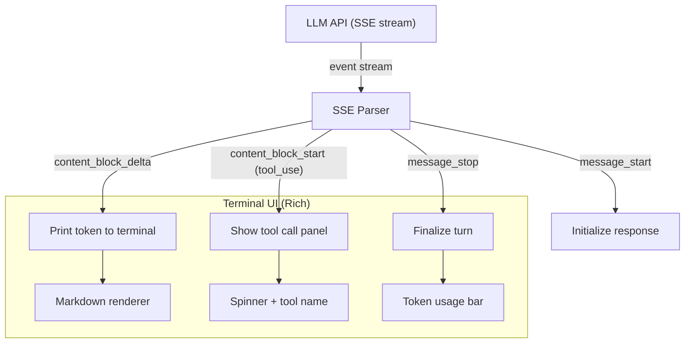

# Rebuild Coding Agent in Python -- Incremental Plan

## Source Architecture Summary

The existing Rust claw-code is structured as:
- **api** -- LLM provider clients (Anthropic, OpenAI), SSE streaming, message types
- **runtime** -- Conversation loop, session persistence, tool dispatch, permissions, prompt assembly, compaction, hooks, MCP
- **tools** -- 14 built-in tools (bash, read_file, write_file, edit_file, glob_search, grep_search, WebFetch, WebSearch, TodoWrite, Agent, etc.)
- **cli** -- Terminal UI, input/output rendering, main entry point
- **plugins** -- Hook system, plugin lifecycle
- **telemetry** -- Usage tracking, cost estimation

---

## Step 1: Minimal LLM Chat Loop

**What we build:** A CLI that sends user messages to an LLM API and prints responses. No tools, no streaming -- just the simplest possible request/response cycle.

**Why this is first:** Everything in a coding agent is built on top of calling an LLM. If you don't understand the message format (system prompt, user messages, assistant responses), nothing else makes sense. This is the foundation every other step depends on.

**What you learn:**
- How the Anthropic/OpenAI Messages API works (roles, content blocks, tokens)
- The basic request/response cycle: `messages -> API -> response`
- API key management and authentication
- Token usage and cost awareness

**Output:** A running `python agent.py` that accepts user input in a loop, calls Claude, and prints the response.

**Architecture:**



**Key files to create:**
- `claw_code_python/main.py` -- REPL loop, read input, print output
- `claw_code_python/llm_client.py` -- `send_message(messages) -> response`
- `claw_code_python/models.py` -- `Message`, `ContentBlock` dataclasses
- `requirements.txt` -- `httpx`, `pydantic`

**Reference from Rust:** [`rust/crates/api/src/types.rs`](rust/crates/api/src/types.rs) (message types), [`rust/crates/api/src/providers/anthropic.rs`](rust/crates/api/src/providers/anthropic.rs) (API call)

---

## Step 2: Tool Definitions + The Agent Loop

**What we build:** Add the concept of "tools" that the LLM can call. Implement the core agent loop: send messages -> LLM responds with tool_use -> execute tool -> feed result back -> repeat until LLM responds with text only.

**Why this is second:** This single addition is what transforms a chatbot into an agent. The agentic loop is THE fundamental pattern -- understanding it deeply is the whole point of this project.

**What you learn:**
- How function calling / tool use works (tool definitions sent in the request, tool_use blocks in the response)
- The agent loop pattern: `while has_tool_calls: execute -> feed back`
- How tool input/output flows through the conversation as content blocks
- The difference between a "chat" and an "agent"

**Output:** Agent that can call a simple `calculator` tool. When you say "what's 42 * 17?", the LLM calls the calculator tool, gets the result, and responds with the answer.

**Architecture:**



**Key files to create/modify:**
- `claw_code_python/tools/base.py` -- `Tool` base class with `name`, `description`, `input_schema`, `execute(input)`
- `claw_code_python/tools/calculator.py` -- simple demo tool
- `claw_code_python/tool_registry.py` -- registry of available tools, dispatch by name
- `claw_code_python/agent_loop.py` -- the core `run_turn()` loop (mirrors `ConversationRuntime.run_turn()` in [`rust/crates/runtime/src/conversation.rs:296-485`](rust/crates/runtime/src/conversation.rs))

**Reference from Rust:** The `run_turn()` method at line 296-485 in `conversation.rs` -- this is the heart of the agent.

---

## Step 3: File System Tools (Read, Write, Edit)

**What we build:** The three essential file tools: `read_file`, `write_file`, `edit_file` (string replacement). Now the agent can actually read and modify code.

**Why this is third:** A coding agent that cannot read or modify files is useless. These are the minimum viable tools for any coding task. We add them before bash because file operations are safer and easier to reason about.

**What you learn:**
- How an agent interacts with the filesystem
- The `edit_file` pattern (find-and-replace rather than rewriting entire files) -- this is a key design choice that prevents the agent from accidentally destroying file content
- Path validation and workspace boundary safety
- Binary file detection, line-number output formatting

**Output:** You can say "read the file at X" or "change the function name from foo to bar in X" and the agent does it.

**Architecture:**



**Key files to create:**
- `claw_code_python/tools/read_file.py` -- read with optional offset/limit, line numbering, binary detection
- `claw_code_python/tools/write_file.py` -- write with size limit validation
- `claw_code_python/tools/edit_file.py` -- find old_string, replace with new_string, uniqueness check

**Reference from Rust:** [`rust/crates/runtime/src/file_ops.rs`](rust/crates/runtime/src/file_ops.rs) (all three tools implemented here)

---

## Step 4: Shell Execution Tool (Bash)

**What we build:** A `bash` tool that executes shell commands, captures stdout/stderr, handles timeouts, and returns results.

**Why this is fourth:** After file ops, running commands is the second most critical capability. The agent needs to run tests, install dependencies, check git status, etc. We add it after file tools because it introduces subprocess management and security considerations.

**What you learn:**
- Subprocess management in Python (subprocess.run, Popen)
- Timeout handling for long-running commands
- stdout/stderr capture and formatting
- The security implications of letting an LLM run arbitrary commands
- Why sandboxing matters (even though we won't implement full sandboxing yet)

**Output:** You can say "run the tests" or "install numpy" and the agent executes it and reports back.

**Architecture:**



**Key files to create:**
- `claw_code_python/tools/bash.py` -- command execution, timeout, output capture, truncation

**Reference from Rust:** [`rust/crates/runtime/src/bash.rs`](rust/crates/runtime/src/bash.rs)

---

## Step 5: Search Tools (Glob + Grep)

**What we build:** `glob_search` (find files by pattern) and `grep_search` (search file contents by regex). Now the agent can navigate and explore any codebase.

**Why this is fifth:** An agent working on a real codebase needs to find files and search for code. Without these, it would need to guess file paths or ask the user for every location. These tools are what make the agent self-sufficient in exploring code.

**What you learn:**
- How agents explore unfamiliar codebases (search -> read -> understand -> modify)
- Glob patterns and recursive file traversal
- Regex search with context lines (like ripgrep)
- Output formatting and result truncation for large codebases
- Respecting .gitignore and hidden files

**Output:** A fully functional coding agent. You can point it at any repo and say "find all Python files that import requests" or "what files match `**/test_*.py`" and it navigates independently.

**Architecture:**



**Key files to create:**
- `claw_code_python/tools/glob_search.py` -- recursive glob with .gitignore support
- `claw_code_python/tools/grep_search.py` -- regex search with context lines, output modes

**Reference from Rust:** [`rust/crates/runtime/src/file_ops.rs`](rust/crates/runtime/src/file_ops.rs) (glob_search and grep_search functions)

**Milestone: At this point you have a WORKING coding agent.** Steps 1-5 give you the minimum viable coding agent that can chat, read/write/edit files, run commands, and search code. Everything after this is enhancement.

---

## Step 6: System Prompt + Project Context Injection

**What we build:** Dynamic system prompt assembly that includes: base instructions, current date, git status, working directory, and CLAUDE.md / AGENTS.md instruction files found in the project.

**Why this is sixth:** Up to now the system prompt was a static string. But real coding agents are dramatically more effective when they have context about the project, its conventions, and current state. This is where prompt engineering for agents gets serious.

**What you learn:**
- How system prompts shape agent behavior (tool usage instructions, safety rules, output formatting)
- Project-context discovery (walking up directories for instruction files)
- The instruction file pattern (CLAUDE.md, .claude/ files) -- how repos customize agent behavior
- Git context injection (current branch, status, recent commits)
- Token budget management for system prompts

**Output:** Agent that automatically understands the project it's working in. Drop it into any repo with a CLAUDE.md and it picks up conventions.

**Architecture:**



**Key files to create:**
- `claw_code_python/prompt.py` -- `SystemPromptBuilder`, instruction file discovery, git context
- `claw_code_python/git_context.py` -- git status, branch, diff extraction

**Reference from Rust:** [`rust/crates/runtime/src/prompt.rs`](rust/crates/runtime/src/prompt.rs), [`rust/crates/runtime/src/git_context.rs`](rust/crates/runtime/src/git_context.rs)

---

## Step 7: Session Persistence + Conversation History

**What we build:** Save/load conversation sessions to disk as JSONL files. Support resuming sessions, listing past sessions, and session metadata (timestamps, token usage).

**Why this is seventh:** Until now, every conversation is lost when you close the terminal. Persistence enables: resume interrupted work, review what the agent did, and is a prerequisite for compaction (Step 8).

**What you learn:**
- Conversation serialization (messages with tool_use/tool_result blocks are complex to serialize)
- JSONL append-only format for crash safety
- Session ID management, session listing/selection
- Replay and resume patterns

**Output:** `python agent.py --resume` continues where you left off. `python agent.py --list` shows past sessions.

**Architecture:**



**Key files to create:**
- `claw_code_python/session.py` -- Session class with save/load/list, JSONL persistence

**Reference from Rust:** [`rust/crates/runtime/src/session.rs`](rust/crates/runtime/src/session.rs)

---

## Step 8: Permission System

**What we build:** A permission layer that controls which tools the agent can use without asking. Three modes: `read-only` (only read/search tools), `workspace-write` (can edit files), `full-access` (can run bash). Dangerous operations prompt the user for approval.

**Why this is eighth:** Now that the agent has real power (bash, file writes), you need guardrails. The permission system is what makes it safe to let the agent operate with some autonomy.

**What you learn:**
- Permission models: allow-by-default vs deny-by-default
- Tool-level authorization (each tool declares its required permission level)
- Interactive prompting for elevated permissions
- The tension between safety and usability in agent systems

**Output:** Agent in `workspace-write` mode can read/write files freely but asks before running bash commands.

**Architecture:**



**Key files to create:**
- `claw_code_python/permissions.py` -- `PermissionMode`, `PermissionPolicy`, `authorize()`, interactive prompter

**Reference from Rust:** [`rust/crates/runtime/src/permissions.rs`](rust/crates/runtime/src/permissions.rs)

---

## Step 9: Conversation Compaction (Context Window Management)

**What we build:** When the conversation gets too long, automatically summarize older messages while preserving recent ones. This uses the LLM itself to generate a summary.

**Why this is ninth:** Long coding sessions easily exceed context windows (200k tokens). Without compaction, the agent just crashes or loses context. This is what makes the agent usable for real work that takes many turns.

**What you learn:**
- Token estimation (counting roughly how many tokens a conversation uses)
- The compaction strategy: summarize old messages, keep recent ones verbatim
- How to use the LLM as a summarizer for its own conversation
- The continuation message pattern ("this session is continued from...")
- The tradeoff between context retention and token budget

**Output:** Agent that can work through 50+ turn sessions without running out of context. You see a "[compacted]" notice when it happens.

**Architecture:**



**Key files to create:**
- `claw_code_python/compact.py` -- token estimation, `should_compact()`, `compact_session()`, summary formatting

**Reference from Rust:** [`rust/crates/runtime/src/compact.rs`](rust/crates/runtime/src/compact.rs)

---

## Step 10: Streaming Output + Rich Terminal UI

**What we build:** Stream LLM responses token-by-token using SSE (Server-Sent Events). Add a rich terminal UI with colored output, markdown rendering, spinner for tool execution, and token usage display.

**Why this is tenth:** Until now output appears all at once when the LLM finishes. Streaming makes the agent feel alive and responsive. The rich UI makes it pleasant to use for extended sessions.

**What you learn:**
- SSE (Server-Sent Events) parsing for streaming API responses
- How content_block_start, content_block_delta, content_block_stop events assemble into a response
- Terminal UI with Rich library (markdown rendering, progress bars, panels)
- How to interleave streaming text with tool execution displays

**Output:** A polished CLI experience where you see the agent's response appear word-by-word, tool calls display with spinners, and results are beautifully formatted.

**Architecture:**



**Key files to create:**
- `claw_code_python/streaming.py` -- SSE parser, event types, delta accumulator
- `claw_code_python/ui.py` -- Rich-based terminal UI, markdown rendering, tool panels

**Reference from Rust:** [`rust/crates/api/src/sse.rs`](rust/crates/api/src/sse.rs), [`rust/crates/rusty-claude-cli/src/render.rs`](rust/crates/rusty-claude-cli/src/render.rs)

---

## Future Steps (after the core 10)

After completing steps 1-10, you'll have a fully functional, polished coding agent. Here are natural next extensions, in rough priority order:

- **Multi-provider support** -- Add OpenAI, xAI providers alongside Anthropic (reference: [`rust/crates/api/src/client.rs`](rust/crates/api/src/client.rs))
- **Configuration system** -- Layered config: user-level, project-level, local overrides (reference: [`rust/crates/runtime/src/config.rs`](rust/crates/runtime/src/config.rs))
- **Hook system** -- Pre/post tool-use hooks for custom validation (reference: [`rust/crates/runtime/src/hooks.rs`](rust/crates/runtime/src/hooks.rs))
- **MCP integration** -- Model Context Protocol for external tool servers (reference: [`rust/crates/runtime/src/mcp.rs`](rust/crates/runtime/src/mcp.rs))
- **Sub-agent spawning** -- Delegate tasks to child agents (reference: the `Agent` tool in tools/lib.rs)
- **Web tools** -- WebFetch and WebSearch for internet access
- **Plugin system** -- Third-party tool loading (reference: [`rust/crates/plugins/`](rust/crates/plugins/))

---

## Project Structure (final shape after Step 10)

```
claw-code-python/
  claw_code_python/
    __init__.py
    main.py              # CLI entry point + REPL
    agent_loop.py        # Core conversation loop (run_turn)
    llm_client.py        # Anthropic API client
    streaming.py         # SSE parser
    models.py            # Message, ContentBlock, etc.
    session.py           # Session persistence
    prompt.py            # System prompt assembly
    git_context.py       # Git status/branch extraction
    permissions.py       # Permission policy + prompter
    compact.py           # Conversation compaction
    tool_registry.py     # Tool registration + dispatch
    ui.py                # Rich terminal rendering
    tools/
      __init__.py
      base.py            # Tool base class
      calculator.py      # Demo tool (Step 2)
      read_file.py
      write_file.py
      edit_file.py
      bash.py
      glob_search.py
      grep_search.py
  requirements.txt
  README.md
```
